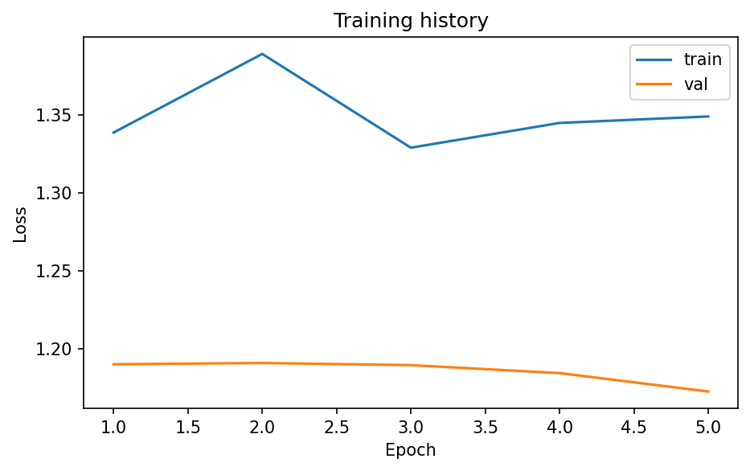
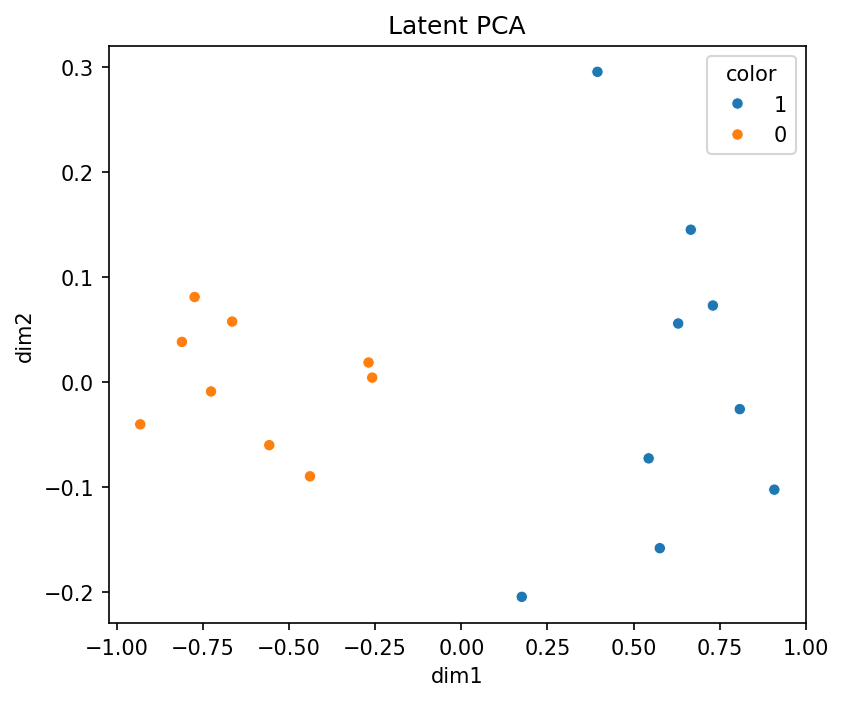
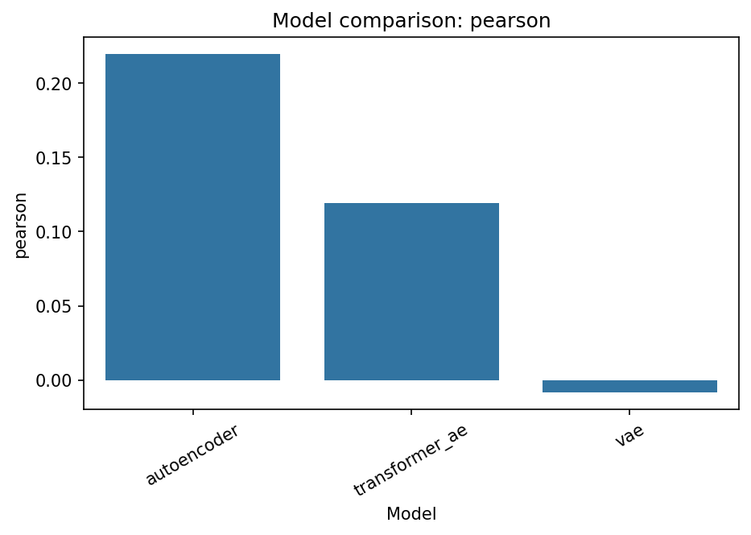

# scDLKit

AnnData-native deep-learning baselines for single-cell workflows.

Train, evaluate, compare, and visualize baseline models without rebuilding PyTorch loops, dataloaders, and plotting code from scratch.

[Install and quickstart](quickstart.md){ .md-button .md-button--primary }
[Open tutorials](tutorials.md){ .md-button }
[API reference](api.md){ .md-button }

## Start Here

-   __Beginner notebook__

    ---

    Start with the Jupyter workflow most researchers expect. It creates a small synthetic `AnnData`, trains a baseline model, evaluates it, and saves plots and reports.

    [Open the notebook guide](tutorials.md#beginner-notebook)

-   __PBMC tutorial notebooks__

    ---

    Move to real-data walkthroughs for VAE training, baseline comparison, and classification once the first notebook is familiar.

    [See all notebook tutorials](tutorials.md#pbmc-notebooks)

-   __Quick API entry__

    ---

    If you want the smallest package-level run, use `TaskRunner` and keep everything in a few lines of Python.

    [Go to quickstart](quickstart.md#minimal-python-api-example)

-   __Research workflow__

    ---

    Keep `AnnData` as the central object, benchmark multiple models, and export plots and Markdown reports for downstream analysis.

    [Explore comparison utilities](comparison.md)

## What scDLKit includes

- Data preparation directly from `AnnData`
- Baseline models for reconstruction, representation learning, and classification
- Plain-PyTorch training with early stopping and checkpoint restoration
- Built-in metrics, reports, and visualizations
- Notebook and script examples for portfolio-ready workflows

## Example outputs

  

    
    
Training loss curve generated by the beginner notebook workflow.

  

  

    
    
Latent PCA projection produced from the first end-to-end notebook.

  

  

    
    
Model-comparison plot from the PBMC benchmarking tutorial.

  

## Target users

- Single-cell researchers
- Computational biology students
- Bioinformatics researchers entering deep learning
- Applied ML scientists moving into omics
